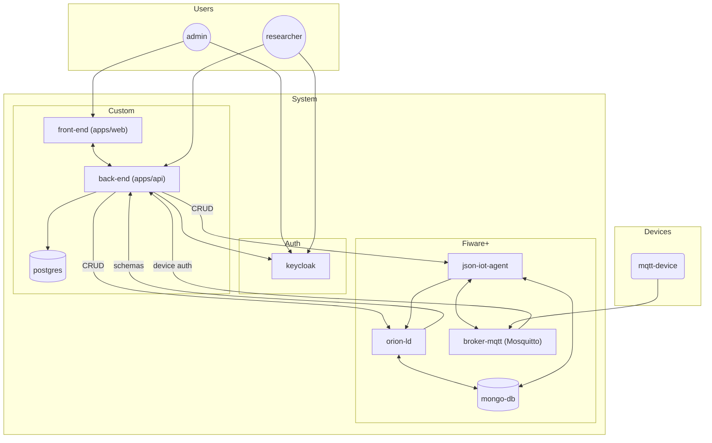

# Masters System

A multi-tenant IoT and Context Management platform integrating modern web interfaces, Fastify backend services, Keycloak authentication, and the FIWARE ecosystem (Orion-LD, IoT Agent JSON, Mosquitto MQTT with Dynamic Security).

---

## Overview & Objectives

The system provides a secure and unified environment for managing research projects, IoT infrastructures, and NGSI-LD context data:

- **Multi-Tenant Administration**: Manage projects, users, and security configurations across brokers and context engines.
- **Context & Entity Management**: Model, monitor, and query real-time entity states via FIWARE Orion-LD.
- **IoT Device Integration & Control**: Provision IoT devices via IoT Agent JSON and Mosquitto MQTT with Dynamic Security access control (ACLs), collecting telemetry and dispatching actuator commands.

---

## 👥 User Roles & Permissions

### Administrator (`admin`)

- Register and configure new research projects.
- Manage user permissions and project assignments.
- Configure MQTT Broker Dynamic Security policies (clients, roles, and ACLs).

### Researcher (`researcher`)

- Define and manage NGSI-LD contexts for assigned projects.
- Manage project entities (create, read, update, delete).
- Query real-time and historical state of entities.
- Dispatch actuator commands to registered IoT devices.

---

## 📂 Repository Structure

The project is organized as a `pnpm` monorepo:

```
masters-system/
├── apps/
│   ├── api/          # Fastify REST API backend
│   │   └── src/
│   │       ├── plugins/   # Fastify plugins (Auth, MQTT DynSec, CORS, DB)
│   │       └── routes/    # Route handlers & endpoint controllers
│   └── web/          # React + Vite dashboard web application
│       └── src/
│           ├── pages/     # Dashboard, Admin, and Research views
│           ├── components/# UI components and layout widgets
│           └── services/  # API and authentication client services
├── packages/
│   └── types/        # Shared TypeScript interfaces & Zod validation schemas
└── package.json      # Workspace root configuration
```

---

## 🏗️ Architecture



---

## 🚀 Getting Started

### Prerequisites

- Node.js (>= 20)
- pnpm (>= 9)
- Docker & Docker Compose (for Keycloak, Mosquitto, Orion-LD, IoT Agent, MongoDB, and PostgreSQL)

### Development

```bash
# Install dependencies
pnpm install

# Start API in development mode
pnpm --filter api dev

# Start Web dashboard in development mode
pnpm --filter web dev

# Build all packages and applications
pnpm build
```
