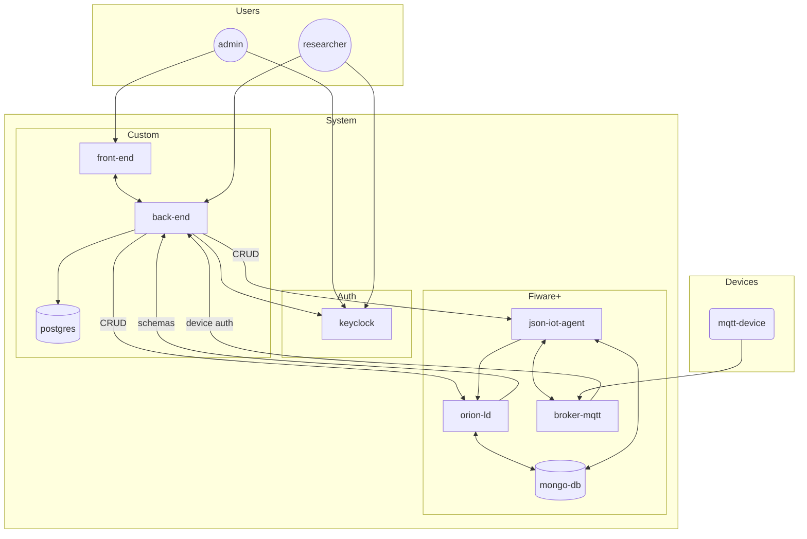

# masters-system

## Web Description

Quem vai utilizar o sistema?

- Admin 
- Pesquisadores

Oque cada um vai poder fazer no sistema?

Admin:

 - Cadastrar um novo projeto
 - Gerenciar usuários daquele projeto

Pesquisadores

 - Criar context para o projeto
 - Gerenciar entidades do projeto
 - Fazer requisição para saber o estado das entidades
 - Enviar comandos para as entidades

## Architecture

