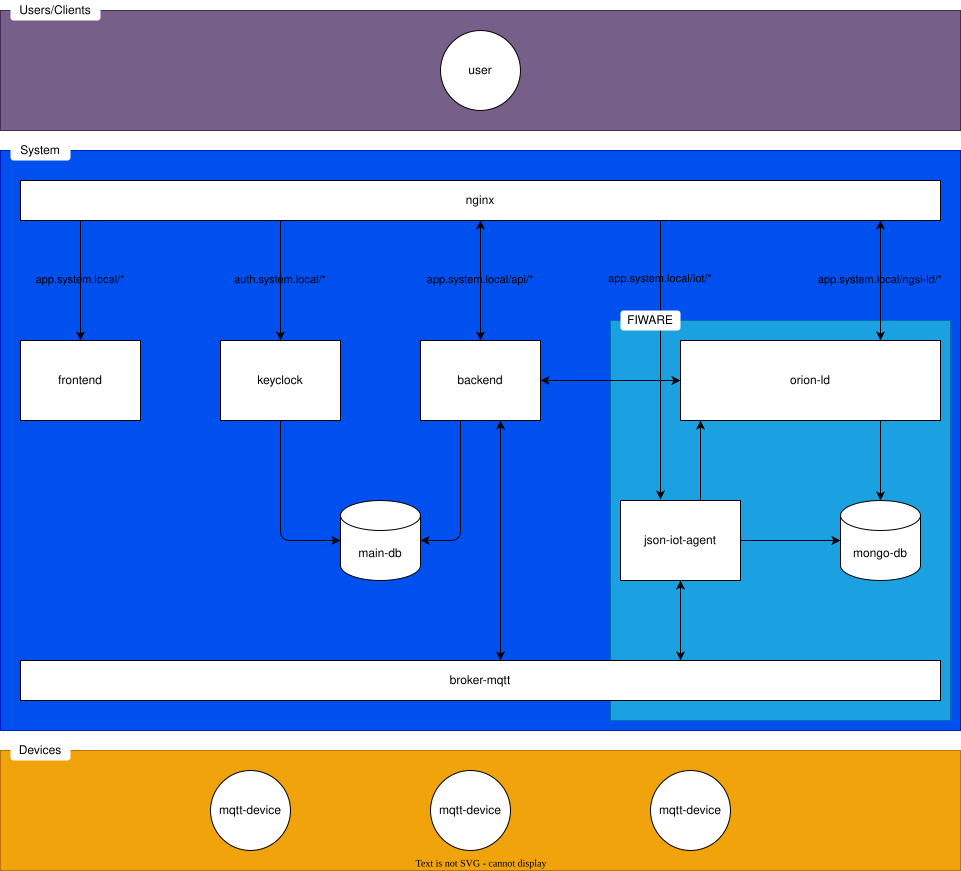

# Masters System

A multi-tenant IoT platform for integrating, managing, and visualizing data from heterogeneous devices across research projects.

---

## Overview & Objectives

Developed to address infrastructure redundancy at CEDRI (Research Centre in Digitalization and Intelligent Robotics), where new IoT projects previously required deploying dedicated stacks from scratch, leading to setup overhead and fragmented data.

Objectives:

- **Device Management:** Provision and manage heterogeneous IoT devices across projects without dedicated infrastructure.
- **Current & Temporal Data API:** Provide standardized NGSI-LD APIs for real-time state snapshots and time-series queries.
- **Access Control & Multi-Tenancy:** Enforce project isolation via Keycloak (RBAC), Orion-LD service paths, and runtime MQTT ACLs (Mosquitto Dynamic Security).
- **Data Visualization:** Web dashboard for monitoring entity states and dispatching device commands.

---

## Architecture

<p align="center">
  
</p>

Components:

- **FIWARE Orion-LD & IoT Agent (JSON):** Context broker and protocol adapter for NGSI-LD entities and device telemetry.
- **Eclipse Mosquitto (Dynamic Security):** MQTT broker with runtime, per-project authentication and authorization.
- **Keycloak:** OIDC identity provider managing user roles and project groups.
- **NGINX:** Reverse proxy for HTTPS (`443`) and MQTTS (`8883`) termination.
- **Databases:** PostgreSQL (Keycloak, backend service) and MongoDB (Orion-LD, IoT Agent).

---

## Repository Structure

```text
masters-system/
├── apps/
│   ├── api/        # Fastify REST backend
│   └── web/        # React + Vite dashboard
├── packages/
│   └── types/      # Shared TypeScript types and Zod schemas
├── volumes/        # Service configs and data (NGINX, Mosquitto, Keycloak)
└── docker-compose.yml
```

---

## Getting Started

Development runs inside VS Code Dev Containers, which automatically provisions infrastructure containers and runtime dependencies.

### 1. Local DNS Configuration

Add the local domains to `/etc/hosts` (or `C:\Windows\System32\drivers\etc\hosts` on Windows):

```text
127.0.0.1 app.system.local auth.system.local
```

### 2. SSL/TLS Certificates

Generate development certificates with `mkcert` inside `volumes/nginx/certs/`:

```bash
cd volumes/nginx/certs

# HTTPS certificate for web dashboard and Keycloak
mkcert -cert-file auth.system.local+1.pem -key-file auth.system.local+1-key.pem auth.system.local app.system.local

# MQTTS certificate for IoT clients (uses host IP and localhost rather than domains)
mkcert -cert-file mqtt-cert.pem -key-file mqtt-key.pem localhost 127.0.0.1 <HOST_IP>
```

### 3. Start Dev Container

1. Open the repository in VS Code.
2. Run `Dev Containers: Reopen in Container` from the Command Palette.
3. Services in `docker-compose.yml` start automatically, followed by `pnpm install`.

### 4. Run Development Servers

Inside the Dev Container terminal:

```bash
pnpm dev
```

### 5. Service Endpoints

- Web Dashboard: `https://app.system.local`
- Keycloak Console: `https://auth.system.local` (setup instructions in [keycloak-setup.md](keycloak-setup.md))
- API Documentation: `https://app.system.local/api/docs`
- MQTTS Broker: `mqtts://<HOST_IP>:8883` or `mqtts://localhost:8883`

---

## License

Licensed under the [Apache License 2.0](LICENSE).
